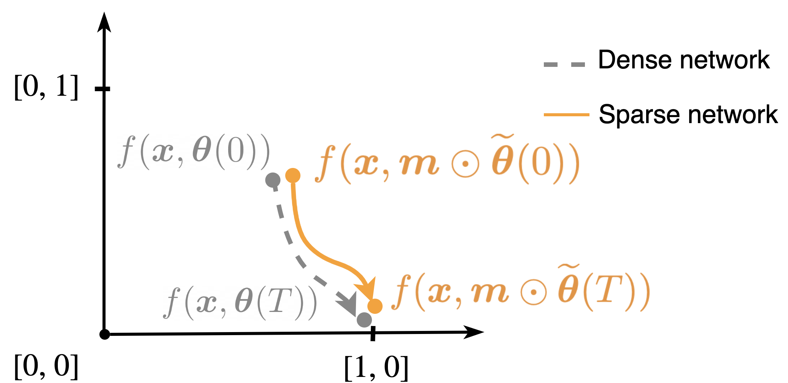

# Finding trainable sparse networks through Neural Tangent Transfer

**Authors:** Tianlin Liu and Friedemann Zenke.

This repository contains code to reproduce the experiments of our "Finding trainable sparse networks through Neural Tangent Transfer" published at ICML 2020.

~~~bib
  @article{Liu2020finding,
    Title = {Finding trainable sparse networks through Neural Tangent Transfer},
    Author = {Tianlin Liu and Friedemann Zenke},
    journal={Proceedings of the 37th International Conference on Machine Learning (ICML)},
    Year = {2020},
    address={Vienna, Austria}
  }
~~~  

## Description

How to initialize a sparse deep neural network without compromising its performance? Our paper tackles this issue by instantiating sparse neural networks whose training dynamics in function space are as close as possible to the training dynamics of a dense one.

We achieve this by minimizing the mismatch between the neural tangent kernels of the sparse and a dense teacher network, a method we refer to as *Neural Tangent Transfer* (NTT). NTT has two key advantages: (i) it only requires label-free data, and (ii) it can be used to find trainable layerwise sparse networks, e.g., CNNs with sparse convolutional filters, which are desirable for energy-efficient inference.

## Installation
Code was tested on

* Python 3.7
* [jaxlib](https://github.com/google/jax) 0.1.37 
* [jax](https://github.com/google/jax) 0.1.55

## Usage

We have prepared Jupyter notebooks in the ./notebooks/ folder to demonstrate NTT.

There are two main python scripts in the folder `nt_transfer`: `ntt.py` and `exploit.py`. The first `ntt.py` script takes care of the **NTT optimization phase**, where we use label-free data to learn the sparse neural network initialization; the second `exploit.py` takes care the **supervised learning phase**, where we perform supervised learning using labeled data.